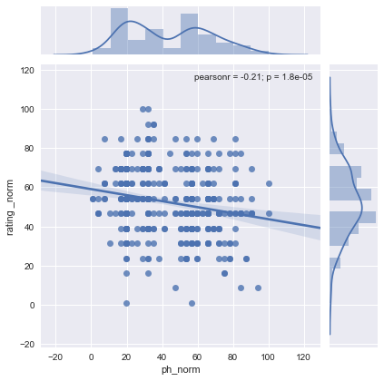
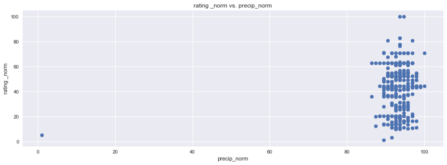
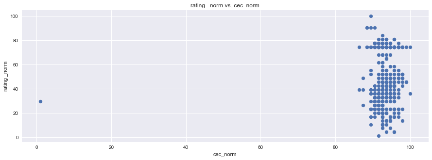

## New New World

<p align="center">
    
</p>


# Objective

Discover which environmental properties are prime for Sauvignon Blanc grape cultivation and develop a web application for users to interact with and gather relevant data on a specified location.


# Background

Sauvignon blanc is a green-skinned grape variety that originates from the Bordeaux region of France. The grape most likely gets its name from the French words sauvage ("wild") and blanc ("white") due to its early origins as an indigenous grape in South West France.


Sauvignon blanc is currently widely cultivated in France, Chile, Canada, Australia, New Zealand, South Africa, the states of Washington and California in the US. It can develop desirable flavors in both cool and warm environments. Such as, flavors of grass, green bell peppers, tropical fruit, and floral notes It buds early, grows quickly, and can produce several harvest within the same year.

_SB has a Short fermentation cycle, that’s why we are only reviewing 2016 data_


#### Why Sauvignon Blanc (SB)?
According to _Wine Economist_, Sauvignon Blanc is one of the most popular and most profitable wines in the world


### Questions this application will attempt to answer:
+ What are the various geographical locations in which SB currently thrives?
+ What are the soil properties at those regions?
+ What are the climate conditions for those locations over the span of 2016?
+ Providing a location input, what are the soil and climate properties at that site?


---

---


## Step 1 - Data Gathering

Data was collected from these 2 APIs

<a href="https://rest.soilgrids.org/"></a><br>
<a href="https://developer.worldweatheronline.com/"></a>

and scraped from:

<a href="https://www.winemag.com/"></a>


## Step 2 - Data Analysis

### Analysis done strictly on vineyard environments rated by Wine Enthusiast

As you will notice in the first jupyter notebook analysis down below, initially correlations were not strong because the data was narrow. It only represents places that are known for moderate to great wine. By passing in a desert location, indicated in the second analysis, and using climate and soil components from a location that is far from ideal, it accentuated the correlation.


```python
import pandas as pd
import matplotlib.pyplot as plt
import seaborn as sns
```


```python
filename = 'Normalized Wine Correlations and Dropped.xlsx'
wine = pd.read_excel(filename)
wine.head()
```


<div>
<!-- <style>
    .dataframe thead tr:only-child th {
        text-align: right;
    }

    .dataframe thead th {
        text-align: left;
    }

    .dataframe tbody tr th {
        vertical-align: top;
    }
</style> -->
<table border="1" class="dataframe">
  <thead>
    <tr style="text-align: right;">
      <th></th>
      <th>iso3</th>
      <th>appell_city</th>
      <th>appell_country</th>
      <th>appell_region</th>
      <th>appell_state</th>
      <th>lat</th>
      <th>lon</th>
      <th>lat.1</th>
      <th>lon.1</th>
      <th>price</th>
      <th>...</th>
      <th>clay_correl</th>
      <th>pH</th>
      <th>ph_norm</th>
      <th>ph_correl</th>
      <th>water_at_withering</th>
      <th>waw_norm</th>
      <th>waw_correl</th>
      <th>bulk_density</th>
      <th>bulk_norm</th>
      <th>bulk_correl</th>
    </tr>
  </thead>
  <tbody>
    <tr>
      <th>0</th>
      <td>ARG</td>
      <td>Argentina</td>
      <td>Argentina</td>
      <td>Mendoza Province</td>
      <td>Mendoza Province</td>
      <td>-32.889625</td>
      <td>-68.852687</td>
      <td>-32.889625</td>
      <td>-68.852687</td>
      <td>18</td>
      <td>...</td>
      <td>-0.027127</td>
      <td>77</td>
      <td>78.34375</td>
      <td>-0.211055</td>
      <td>17</td>
      <td>34.0</td>
      <td>0.092602</td>
      <td>1489</td>
      <td>66.089655</td>
      <td>0.032192</td>
    </tr>
    <tr>
      <th>1</th>
      <td>ARG</td>
      <td>Mendoza Province</td>
      <td>Argentina</td>
      <td>Luján de Cuyo</td>
      <td>Mendoza Province</td>
      <td>-33.039104</td>
      <td>-68.879864</td>
      <td>-33.039104</td>
      <td>-68.879864</td>
      <td>42</td>
      <td>...</td>
      <td>NaN</td>
      <td>78</td>
      <td>81.43750</td>
      <td>NaN</td>
      <td>17</td>
      <td>34.0</td>
      <td>NaN</td>
      <td>1518</td>
      <td>72.689655</td>
      <td>NaN</td>
    </tr>
    <tr>
      <th>2</th>
      <td>ARG</td>
      <td>Mendoza Province</td>
      <td>Argentina</td>
      <td>Mendoza</td>
      <td>Mendoza Province</td>
      <td>-32.889459</td>
      <td>-68.845839</td>
      <td>-32.889459</td>
      <td>-68.845839</td>
      <td>10</td>
      <td>...</td>
      <td>NaN</td>
      <td>77</td>
      <td>78.34375</td>
      <td>NaN</td>
      <td>17</td>
      <td>34.0</td>
      <td>NaN</td>
      <td>1479</td>
      <td>63.813793</td>
      <td>NaN</td>
    </tr>
    <tr>
      <th>3</th>
      <td>ARG</td>
      <td>Mendoza Province</td>
      <td>Argentina</td>
      <td>Uco Valley</td>
      <td>Mendoza Province</td>
      <td>-33.600036</td>
      <td>-69.282703</td>
      <td>-33.600036</td>
      <td>-69.282703</td>
      <td>15</td>
      <td>...</td>
      <td>NaN</td>
      <td>78</td>
      <td>81.43750</td>
      <td>NaN</td>
      <td>18</td>
      <td>40.6</td>
      <td>NaN</td>
      <td>1421</td>
      <td>50.613793</td>
      <td>NaN</td>
    </tr>
    <tr>
      <th>4</th>
      <td>ARG</td>
      <td>Mendoza Province</td>
      <td>Argentina</td>
      <td>Uco Valley</td>
      <td>Mendoza Province</td>
      <td>-33.600036</td>
      <td>-69.282703</td>
      <td>-33.600036</td>
      <td>-69.282703</td>
      <td>10</td>
      <td>...</td>
      <td>NaN</td>
      <td>78</td>
      <td>81.43750</td>
      <td>NaN</td>
      <td>18</td>
      <td>40.6</td>
      <td>NaN</td>
      <td>1421</td>
      <td>50.613793</td>
      <td>NaN</td>
    </tr>
  </tbody>
</table>
<p>5 rows × 105 columns</p>
</div>


```python
df = wine[['growing_temp_correl','year_temp_correl','max_temp_correl','min_temp_correl','max_min_correl',
      'hum_correl','precip_correl','carbon_correl','cec_correl','clay_correl','ph_correl',
      'waw_correl','bulk_correl']]
new_df = df[0:1]
new_df
```


<div>
<!-- <style>
    .dataframe thead tr:only-child th {
        text-align: right;
    }

    .dataframe thead th {
        text-align: left;
    }

    .dataframe tbody tr th {
        vertical-align: top;
    }
</style> -->
<table border="1" class="dataframe">
  <thead>
    <tr style="text-align: right;">
      <th></th>
      <th>growing_temp_correl</th>
      <th>year_temp_correl</th>
      <th>max_temp_correl</th>
      <th>min_temp_correl</th>
      <th>max_min_correl</th>
      <th>hum_correl</th>
      <th>precip_correl</th>
      <th>carbon_correl</th>
      <th>cec_correl</th>
      <th>clay_correl</th>
      <th>ph_correl</th>
      <th>waw_correl</th>
      <th>bulk_correl</th>
    </tr>
  </thead>
  <tbody>
    <tr>
      <th>0</th>
      <td>-0.134643</td>
      <td>-0.044223</td>
      <td>-0.152918</td>
      <td>-0.02064</td>
      <td>-0.104366</td>
      <td>0.148011</td>
      <td>0.116698</td>
      <td>0.047044</td>
      <td>0.044261</td>
      <td>-0.027127</td>
      <td>-0.211055</td>
      <td>0.092602</td>
      <td>0.032192</td>
    </tr>
  </tbody>
</table>
</div>


```python
new_df.plot(kind='bar',figsize=(15,5))
plt.title("Correlation coefficient Comparison")
plt.ylabel("Correlation coefficient")
plt.xlabel("Factor")
plt.show()
```


```python
df1 = wine[['growing_temp_norm','rating _norm','year_temp_norm','max_temp_norm','min_temp_norm','max_min_norm',
      'humidity_norm','precip_norm','carbon_norm','cec_norm','clay_norm','ph_norm','waw_norm','bulk_norm']]
df1.head()
```


<div>
<!-- <style>
    .dataframe thead tr:only-child th {
        text-align: right;
    }

    .dataframe thead th {
        text-align: left;
    }

    .dataframe tbody tr th {
        vertical-align: top;
    }
</style> -->
<table border="1" class="dataframe">
  <thead>
    <tr style="text-align: right;">
      <th></th>
      <th>growing_temp_norm</th>
      <th>rating _norm</th>
      <th>year_temp_norm</th>
      <th>max_temp_norm</th>
      <th>min_temp_norm</th>
      <th>max_min_norm</th>
      <th>humidity_norm</th>
      <th>precip_norm</th>
      <th>carbon_norm</th>
      <th>cec_norm</th>
      <th>clay_norm</th>
      <th>ph_norm</th>
      <th>waw_norm</th>
      <th>bulk_norm</th>
    </tr>
  </thead>
  <tbody>
    <tr>
      <th>0</th>
      <td>66.961771</td>
      <td>23.846154</td>
      <td>73.608726</td>
      <td>66.775003</td>
      <td>59.742481</td>
      <td>64.481524</td>
      <td>33.70719</td>
      <td>36.689004</td>
      <td>10.658537</td>
      <td>10.580645</td>
      <td>67.00</td>
      <td>78.34375</td>
      <td>34.0</td>
      <td>66.089655</td>
    </tr>
    <tr>
      <th>1</th>
      <td>66.961771</td>
      <td>46.692308</td>
      <td>73.608726</td>
      <td>66.775003</td>
      <td>59.742481</td>
      <td>64.481524</td>
      <td>33.70719</td>
      <td>36.689004</td>
      <td>8.243902</td>
      <td>10.580645</td>
      <td>64.25</td>
      <td>81.43750</td>
      <td>34.0</td>
      <td>72.689655</td>
    </tr>
    <tr>
      <th>2</th>
      <td>66.961771</td>
      <td>31.461538</td>
      <td>73.608726</td>
      <td>66.775003</td>
      <td>59.742481</td>
      <td>64.481524</td>
      <td>33.70719</td>
      <td>36.689004</td>
      <td>10.658537</td>
      <td>16.967742</td>
      <td>64.25</td>
      <td>78.34375</td>
      <td>34.0</td>
      <td>63.813793</td>
    </tr>
    <tr>
      <th>3</th>
      <td>66.961771</td>
      <td>39.076923</td>
      <td>73.608726</td>
      <td>66.775003</td>
      <td>59.742481</td>
      <td>64.481524</td>
      <td>33.70719</td>
      <td>36.689004</td>
      <td>17.902439</td>
      <td>32.935484</td>
      <td>61.50</td>
      <td>81.43750</td>
      <td>40.6</td>
      <td>50.613793</td>
    </tr>
    <tr>
      <th>4</th>
      <td>66.961771</td>
      <td>31.461538</td>
      <td>73.608726</td>
      <td>66.775003</td>
      <td>59.742481</td>
      <td>64.481524</td>
      <td>33.70719</td>
      <td>36.689004</td>
      <td>17.902439</td>
      <td>32.935484</td>
      <td>61.50</td>
      <td>81.43750</td>
      <td>40.6</td>
      <td>50.613793</td>
    </tr>
  </tbody>
</table>
</div>


```python
plt.figure(figsize=(15,5))
plt.scatter(df1["rating _norm"], df1["year_temp_norm"],facecolors='blue', edgecolors='black', marker="o")
plt.title("rating _norm vs. year_temp_norm")
plt.ylabel("rating _norm")
plt.xlabel("year_temp_norm")
plt.grid(True)

# Show plot
sns.set()
plt.show()
```


```python
plt.figure(figsize=(15,5))
plt.scatter(df1["rating _norm"], df1["max_temp_norm"],facecolors='blue', edgecolors='black', marker="o")
plt.title("rating _norm vs. max_temp_norm")
plt.ylabel("rating _norm")
plt.xlabel("max_temp_norm")
plt.grid(True)

# Show plot
sns.set()
plt.show()
```


```python
plt.figure(figsize=(15,5))
plt.scatter(df1["rating _norm"], df1["max_min_norm"],facecolors='blue', edgecolors='black', marker="o")
plt.title("rating _norm vs. max_min_norm")
plt.ylabel("rating _norm")
plt.xlabel("max_min_norm")
plt.grid(True)

# Show plot
sns.set()
plt.show()
```


```python
plt.figure(figsize=(15,5))
plt.scatter(df1["rating _norm"], df1["humidity_norm"],facecolors='blue', edgecolors='black', marker="o")
plt.title("rating _norm vs. humidity_norm")
plt.ylabel("rating _norm")
plt.xlabel("humidity_norm")
plt.grid(True)

# Show plot
sns.set()
plt.show()
```


```python
plt.figure(figsize=(15,5))
plt.scatter(df1["rating _norm"], df1["precip_norm"],facecolors='blue', edgecolors='black', marker="o")
plt.title("rating _norm vs. precip_norm")
plt.ylabel("rating _norm")
plt.xlabel("precip_norm")
plt.grid(True)

# Show plot
sns.set()
plt.show()
```


```python
plt.figure(figsize=(15,5))
plt.scatter(df1["rating _norm"], df1["carbon_norm"], facecolors='blue', edgecolors='black',marker="o")
plt.title("rating _norm vs. carbon_norm")
plt.ylabel("rating _norm")
plt.xlabel("carbon_norm")
plt.grid(True)

# Show plot
sns.set()
plt.show()
```


<!-- ```python
plt.figure(figsize=(15,5))
plt.scatter(df1["rating _norm"], df1["cec_norm"],facecolors='blue', edgecolors='black', marker="o")
plt.title("rating _norm vs. cec_norm")
plt.ylabel("rating _norm")
plt.xlabel("cec_norm")
plt.grid(True)

# Show plot
sns.set()
plt.show()
```


 -->


<!-- ```python
plt.figure(figsize=(15,5))
plt.scatter(df1["rating _norm"], df1["clay_norm"], facecolors='blue', edgecolors='black',marker="o")
plt.title("rating _norm vs. clay_norm")
plt.ylabel("rating _norm")
plt.xlabel("clay_norm")
plt.grid(True)

# Show plot
sns.set()
plt.show()
```


 -->


```python
plt.figure(figsize=(15,5))
plt.scatter(df1["rating _norm"], df1["ph_norm"],facecolors='blue', edgecolors='black', marker="o")
plt.title("rating _norm vs. ph_norm")
plt.ylabel("rating _norm")
plt.xlabel("ph_norm")
plt.grid(True)

# Show plot
sns.set()
plt.show()
```


```python
plt.figure(figsize=(15,5))
plt.scatter(df1["rating _norm"], df1["waw_norm"], facecolors='blue', edgecolors='black',marker="o")
plt.title("rating _norm vs. waw_norm")
plt.ylabel("rating _norm")
plt.xlabel("waw_norm")
plt.grid(True)

# Show plot
sns.set()
plt.show()
```


<!-- ```python
plt.figure(figsize=(15,5))
plt.scatter(df1["rating _norm"], df1["bulk_norm"],facecolors='blue', edgecolors='black', marker="o")
plt.title("rating _norm vs. bulk_norm")
plt.ylabel("rating _norm")
plt.xlabel("bulk_norm")
plt.grid(True)

# Show plot
sns.set()
plt.show()
```


 -->


<!-- ```python
# multiple linear correlations
```


```python
sns.pairplot(df1, kind="reg")
plt.show()
```


 -->


```python
df2 = df1[["rating _norm","year_temp_norm"]]
sns.pairplot(df2, kind="reg")
plt.show()
```


```python
# df3 = df1[["rating _norm","ph_norm"]]
# sns.pairplot(df3, kind="reg")
# plt.show()
sns.lmplot(x="ph_norm", y="rating _norm", data=df1[["rating _norm","ph_norm"]], x_jitter=.05)
plt.show()
```


```python
sns.lmplot(x="humidity_norm", y="rating _norm", data=df1[["rating _norm","humidity_norm"]], x_jitter=.05)
plt.show()
```


```python
sns.jointplot(x="ph_norm", y="rating _norm", data=df1[["rating _norm","ph_norm"]], kind="reg")
plt.show()
```





```python
sns.lmplot(x='humidity_norm', y="rating _norm", data=df1[["rating _norm",'humidity_norm']], x_jitter=.05)
plt.show()
```


```python
sns.jointplot(x="humidity_norm", y="rating _norm", data=df1[["rating _norm","humidity_norm"]], kind="reg")
plt.show()
```


### Analysis done with the inclusion of a "not so ideal" environment - the desert

Here you can see that the Diurnal Temp Variance during the growing season rather than the entire year have the strongest correlation, followed by Humidity.

These actually are not independent, when you see the mapped locations you will notice the prevalence of coastal locations.

Large bodies of water can moderate temperature effects on surrounding areas. Such bodies of water have a large heat storage capability that can extend the growing season as well as minimize mid-winter temperatures enough to prevent vine damage.


```python
import pandas as pd
import matplotlib.pyplot as plt
import seaborn as sns
```


```python
filename = 'CopyofNormalizedWineCorrelations.xlsx'
wine = pd.read_excel(filename)
wine.head()
```


<div>
<!-- <style>
    .dataframe thead tr:only-child th {
        text-align: right;
    }

    .dataframe thead th {
        text-align: left;
    }

    .dataframe tbody tr th {
        vertical-align: top;
    }
</style> -->
<table border="1" class="dataframe">
  <thead>
    <tr style="text-align: right;">
      <th></th>
      <th>iso3</th>
      <th>appell_city</th>
      <th>appell_country</th>
      <th>appell_region</th>
      <th>appell_state</th>
      <th>lat</th>
      <th>lon</th>
      <th>lat.1</th>
      <th>lon.1</th>
      <th>price</th>
      <th>...</th>
      <th>clay_correl</th>
      <th>pH</th>
      <th>ph_norm</th>
      <th>ph_correl</th>
      <th>water_at_withering</th>
      <th>waw_norm</th>
      <th>waw_correl</th>
      <th>bulk_density</th>
      <th>bulk_norm</th>
      <th>bulk_correl</th>
    </tr>
  </thead>
  <tbody>
    <tr>
      <th>0</th>
      <td>ARG</td>
      <td>Argentina</td>
      <td>Argentina</td>
      <td>Mendoza Province</td>
      <td>Mendoza Province</td>
      <td>-32.889625</td>
      <td>-68.852687</td>
      <td>-32.889625</td>
      <td>-68.852687</td>
      <td>18</td>
      <td>...</td>
      <td>0.063138</td>
      <td>77</td>
      <td>78.34375</td>
      <td>-0.178641</td>
      <td>17</td>
      <td>34.0</td>
      <td>0.157543</td>
      <td>1489</td>
      <td>66.089655</td>
      <td>-0.029926</td>
    </tr>
    <tr>
      <th>1</th>
      <td>TEST</td>
      <td>TEST</td>
      <td>TEST</td>
      <td>DESERT</td>
      <td>TEST</td>
      <td>35.011000</td>
      <td>-115.473460</td>
      <td>35.011000</td>
      <td>-115.473460</td>
      <td>0</td>
      <td>...</td>
      <td>NaN</td>
      <td>80</td>
      <td>87.62500</td>
      <td>NaN</td>
      <td>15</td>
      <td>20.8</td>
      <td>NaN</td>
      <td>1591</td>
      <td>89.303448</td>
      <td>NaN</td>
    </tr>
    <tr>
      <th>2</th>
      <td>ARG</td>
      <td>Mendoza Province</td>
      <td>Argentina</td>
      <td>Luján de Cuyo</td>
      <td>Mendoza Province</td>
      <td>-33.039104</td>
      <td>-68.879864</td>
      <td>-33.039104</td>
      <td>-68.879864</td>
      <td>42</td>
      <td>...</td>
      <td>NaN</td>
      <td>78</td>
      <td>81.43750</td>
      <td>NaN</td>
      <td>17</td>
      <td>34.0</td>
      <td>NaN</td>
      <td>1518</td>
      <td>72.689655</td>
      <td>NaN</td>
    </tr>
    <tr>
      <th>3</th>
      <td>ARG</td>
      <td>Mendoza Province</td>
      <td>Argentina</td>
      <td>Mendoza</td>
      <td>Mendoza Province</td>
      <td>-32.889459</td>
      <td>-68.845839</td>
      <td>-32.889459</td>
      <td>-68.845839</td>
      <td>10</td>
      <td>...</td>
      <td>NaN</td>
      <td>77</td>
      <td>78.34375</td>
      <td>NaN</td>
      <td>17</td>
      <td>34.0</td>
      <td>NaN</td>
      <td>1479</td>
      <td>63.813793</td>
      <td>NaN</td>
    </tr>
    <tr>
      <th>4</th>
      <td>ARG</td>
      <td>Mendoza Province</td>
      <td>Argentina</td>
      <td>Uco Valley</td>
      <td>Mendoza Province</td>
      <td>-33.600036</td>
      <td>-69.282703</td>
      <td>-33.600036</td>
      <td>-69.282703</td>
      <td>15</td>
      <td>...</td>
      <td>NaN</td>
      <td>78</td>
      <td>81.43750</td>
      <td>NaN</td>
      <td>18</td>
      <td>40.6</td>
      <td>NaN</td>
      <td>1421</td>
      <td>50.613793</td>
      <td>NaN</td>
    </tr>
  </tbody>
</table>
<p>5 rows × 105 columns</p>
</div>


```python
df = wine[['growing_temp_correl','year_temp_correl','max_temp_correl','min_temp_correl','max_min_correl',
      'hum_correl','precip_correl','carbon_correl','cec_correl','clay_correl','ph_correl',
      'waw_correl','bulk_correl']]
new_df = df[0:1]
new_df
```


<div>
<!-- <style>
    .dataframe thead tr:only-child th {
        text-align: right;
    }

    .dataframe thead th {
        text-align: left;
    }

    .dataframe tbody tr th {
        vertical-align: top;
    }
</style> -->
<table border="1" class="dataframe">
  <thead>
    <tr style="text-align: right;">
      <th></th>
      <th>growing_temp_correl</th>
      <th>year_temp_correl</th>
      <th>max_temp_correl</th>
      <th>min_temp_correl</th>
      <th>max_min_correl</th>
      <th>hum_correl</th>
      <th>precip_correl</th>
      <th>carbon_correl</th>
      <th>cec_correl</th>
      <th>clay_correl</th>
      <th>ph_correl</th>
      <th>waw_correl</th>
      <th>bulk_correl</th>
    </tr>
  </thead>
  <tbody>
    <tr>
      <th>0</th>
      <td>-0.441547</td>
      <td>-0.403961</td>
      <td>-0.230296</td>
      <td>0.08805</td>
      <td>-0.244262</td>
      <td>0.328747</td>
      <td>0.146282</td>
      <td>0.080658</td>
      <td>0.056495</td>
      <td>0.063138</td>
      <td>-0.178641</td>
      <td>0.157543</td>
      <td>-0.029926</td>
    </tr>
  </tbody>
</table>
</div>


```python
new_df.plot(kind='bar',figsize=(15,5))
plt.title("Correlation coefficient Comparison")
plt.ylabel("Correlation coefficient")
plt.xlabel("Factor")
plt.show()
```


```python
df1 = wine[['rating _norm','growing_temp_norm','year_temp_norm','max_temp_norm','min_temp_norm','max_min_norm',
      'humidity_norm','precip_norm','carbon_norm','cec_norm','clay_norm','ph_norm','waw_norm','bulk_norm']]
df1.head()
```


<div>
<!-- <style>
    .dataframe thead tr:only-child th {
        text-align: right;
    }

    .dataframe thead th {
        text-align: left;
    }

    .dataframe tbody tr th {
        vertical-align: top;
    }
</style> -->
<table border="1" class="dataframe">
  <thead>
    <tr style="text-align: right;">
      <th></th>
      <th>rating _norm</th>
      <th>growing_temp_norm</th>
      <th>year_temp_norm</th>
      <th>max_temp_norm</th>
      <th>min_temp_norm</th>
      <th>max_min_norm</th>
      <th>humidity_norm</th>
      <th>precip_norm</th>
      <th>carbon_norm</th>
      <th>cec_norm</th>
      <th>clay_norm</th>
      <th>ph_norm</th>
      <th>waw_norm</th>
      <th>bulk_norm</th>
    </tr>
  </thead>
  <tbody>
    <tr>
      <th>0</th>
      <td>89.468085</td>
      <td>26.573825</td>
      <td>31.841776</td>
      <td>53.176157</td>
      <td>59.742481</td>
      <td>48.879743</td>
      <td>59.935612</td>
      <td>36.689004</td>
      <td>10.658537</td>
      <td>10.580645</td>
      <td>67.00</td>
      <td>78.34375</td>
      <td>34.0</td>
      <td>66.089655</td>
    </tr>
    <tr>
      <th>1</th>
      <td>1.000000</td>
      <td>100.000000</td>
      <td>100.000000</td>
      <td>100.000000</td>
      <td>21.283835</td>
      <td>100.000000</td>
      <td>1.000000</td>
      <td>5.118899</td>
      <td>1.000000</td>
      <td>29.741935</td>
      <td>42.25</td>
      <td>87.62500</td>
      <td>20.8</td>
      <td>89.303448</td>
    </tr>
    <tr>
      <th>2</th>
      <td>92.627660</td>
      <td>26.573825</td>
      <td>31.841776</td>
      <td>53.176157</td>
      <td>59.742481</td>
      <td>48.879743</td>
      <td>59.935612</td>
      <td>36.689004</td>
      <td>8.243902</td>
      <td>10.580645</td>
      <td>64.25</td>
      <td>81.43750</td>
      <td>34.0</td>
      <td>72.689655</td>
    </tr>
    <tr>
      <th>3</th>
      <td>90.521277</td>
      <td>26.573825</td>
      <td>31.841776</td>
      <td>53.176157</td>
      <td>59.742481</td>
      <td>48.879743</td>
      <td>59.935612</td>
      <td>36.689004</td>
      <td>10.658537</td>
      <td>16.967742</td>
      <td>64.25</td>
      <td>78.34375</td>
      <td>34.0</td>
      <td>63.813793</td>
    </tr>
    <tr>
      <th>4</th>
      <td>91.574468</td>
      <td>26.573825</td>
      <td>31.841776</td>
      <td>53.176157</td>
      <td>59.742481</td>
      <td>48.879743</td>
      <td>59.935612</td>
      <td>36.689004</td>
      <td>17.902439</td>
      <td>32.935484</td>
      <td>61.50</td>
      <td>81.43750</td>
      <td>40.6</td>
      <td>50.613793</td>
    </tr>
  </tbody>
</table>
</div>


```python
plt.figure(figsize=(15,5))
plt.scatter(df1["rating _norm"], df1["max_temp_norm"], marker="o")
plt.title("rating _norm vs. max_temp_norm")
plt.ylabel("rating _norm")
plt.xlabel("max_temp_norm")
plt.grid(True)

# Show plot
sns.set()
plt.show()
```


```python
plt.figure(figsize=(15,5))
plt.scatter(df1["rating _norm"], df1["max_min_norm"], marker="o")
plt.title("rating _norm vs. max_min_norm")
plt.ylabel("rating _norm")
plt.xlabel("max_min_norm")
plt.grid(True)

# Show plot
sns.set()
plt.show()
```


```python
plt.figure(figsize=(15,5))
plt.scatter(df1["rating _norm"], df1["humidity_norm"], marker="o")
plt.title("rating _norm vs. humidity_norm")
plt.ylabel("rating _norm")
plt.xlabel("humidity_norm")
plt.grid(True)

# Show plot
sns.set()
plt.show()
```


```python
plt.figure(figsize=(15,5))
plt.scatter(df1["rating _norm"], df1["precip_norm"], marker="o")
plt.title("rating _norm vs. precip_norm")
plt.ylabel("rating _norm")
plt.xlabel("precip_norm")
plt.grid(True)

# Show plot
sns.set()
plt.show()
```





```python
plt.figure(figsize=(15,5))
plt.scatter(df1["rating _norm"], df1["carbon_norm"], marker="o")
plt.title("rating _norm vs. carbon_norm")
plt.ylabel("rating _norm")
plt.xlabel("carbon_norm")
plt.grid(True)

# Show plot
sns.set()
plt.show()
```


<!-- ```python
plt.figure(figsize=(15,5))
plt.scatter(df1["rating _norm"], df1["cec_norm"], marker="o")
plt.title("rating _norm vs. cec_norm")
plt.ylabel("rating _norm")
plt.xlabel("cec_norm")
plt.grid(True)

# Show plot
sns.set()
plt.show()
```


 -->


<!-- ```python
plt.figure(figsize=(15,5))
plt.scatter(df1["rating _norm"], df1["clay_norm"], marker="o")
plt.title("rating _norm vs. clay_norm")
plt.ylabel("rating _norm")
plt.xlabel("clay_norm")
plt.grid(True)

# Show plot
sns.set()
plt.show()
```


 -->


```python
plt.figure(figsize=(15,5))
plt.scatter(df1["rating _norm"], df1["ph_norm"], marker="o")
plt.title("rating _norm vs. ph_norm")
plt.ylabel("rating _norm")
plt.xlabel("ph_norm")
plt.grid(True)

# Show plot
sns.set()
plt.show()
```


```python
plt.figure(figsize=(15,5))
plt.scatter(df1["rating _norm"], df1["waw_norm"], marker="o")
plt.title("rating _norm vs. waw_norm")
plt.ylabel("rating _norm")
plt.xlabel("waw_norm")
plt.grid(True)

# Show plot
sns.set()
plt.show()
```


<!-- ```python
plt.figure(figsize=(15,5))
plt.scatter(df1["rating _norm"], df1["bulk_norm"], marker="o")
plt.title("rating _norm vs. bulk_norm")
plt.ylabel("rating _norm")
plt.xlabel("bulk_norm")
plt.grid(True)

# Show plot
sns.set()
plt.show()
```


 -->


```python
sns.lmplot(x="growing_temp_norm", y="rating _norm", data=df1[["rating _norm","growing_temp_norm"]], x_jitter=.05)
plt.show()
```


```python
sns.lmplot(x="humidity_norm", y="rating _norm", data=df1[["rating _norm","humidity_norm"]], x_jitter=.05)
plt.show()
```


Wine truly has a goldilocks zone for all of the factors. As mentioned in the website, Humidity extremes can be very damaging to the vine and fruit development, but a moderate amount combined with other factors can produce exceptional wine.

The same is true for Diurnal temp var. No temp variance will leave to under developed flavors, and just poor wine. The stress of temp variation is KEY to
Producing the sugars needed to create delicious and alcoholic wines.

The web application touches on ‘stress’ in temperature and water availability, but to reiterate, a balance of soil and climate stresses are what truly build the character of this wine. This deserves a modification to the old addage - "it grows sweeter with time”" to - "it grows better with stress".


## Step 3 - Application Build


---

---

## Sample Page


# Live Heroku Web-application
## Click [HERE](https://sauvignon-blanc-opt.herokuapp.com/) to play!

